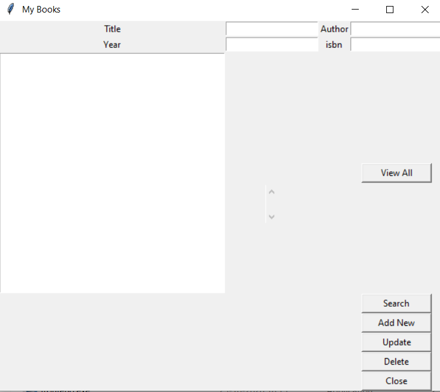

# Bookstore-Application
_______________________

# Application ScreenShoot

# What you can do with this Application?
You can Save all the details of a particular book like book name, author name,
year of publishing, and the isbn number.
You can also search and view your collection

# How to Run it on your PC?
1. Clone this repository in your system.
2. Navigate to Executable File Folder.
3. In this folder you'll find a file name 'frontend.exe' just run this file
